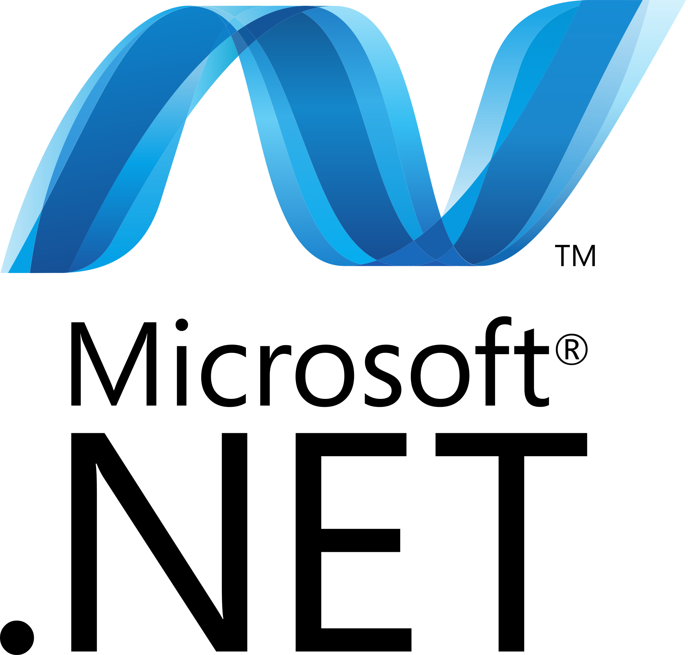

## :octocat: Hi, I'm Oleksandr
<!--
**OleksandrMianovskyi/OleksandrMianovskyi** is a ✨ _special_ ✨ repository because its `README.md` (this file) appears on your GitHub profile.

Here are some ideas to get you started:

- 🔭 I’m currently working on ...
- 🌱 I’m currently learning ...
- 👯 I’m looking to collaborate on ...
- 🤔 I’m looking for help with ...
- 💬 Ask me about ...
- 📫 How to reach me: ...
- 😄 Pronouns: ...
- ⚡ Fun fact: ...

  <a href="https://www.linkedin.com/in/oleksandr-mianovskyi-707890133/" rel="nofollow noreferrer">
     LinkedIn
  </a> &nbsp; 

-->

### :telephone_receiver: Connect with me:
> 

### :man_technologist: Coding Platforms:
> 
 

### Languages and Tools:

